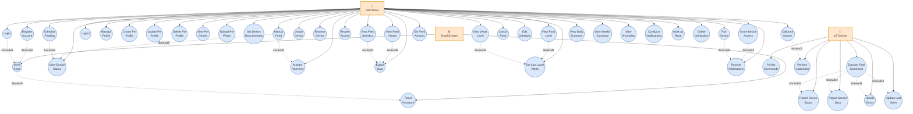

# Use Case Diagram

```mermaid
graph TD
    %% Actors - stick figures represented as special nodes
    PetOwner["👤<br/>Pet Owner"]
    EmailSystem["⚙️<br/>Email System"]
    IoTDevice["🔧<br/>IoT Device"]
    
    %% Authentication & User Management
    UC1(("Register<br/>Account"))
    UC2(("Login"))
    UC3(("Logout"))
    UC4(("Verify<br/>Email"))
    UC5(("Reset<br/>Password"))
    UC6(("Manage<br/>Profile"))
    
    %% Pet Profile Management
    UC7(("Create Pet<br/>Profile"))
    UC8(("Update Pet<br/>Profile"))
    UC9(("Delete Pet<br/>Profile"))
    UC10(("View Pet<br/>Details"))
    UC11(("Upload Pet<br/>Photo"))
    UC12(("Set Dietary<br/>Requirements"))
    
    %% Device Management
    UC13(("Pair<br/>Device"))
    UC14(("Unpair<br/>Device"))
    UC15(("Rename<br/>Device"))
    UC16(("View Device<br/>Status"))
    UC17(("Share Device<br/>Access"))
    UC18(("Revoke<br/>Access"))
    UC19(("Calibrate<br/>Device"))
    
    %% Feeding Operations
    UC20(("Schedule<br/>Feeding"))
    UC21(("Manual<br/>Feed"))
    UC22(("Set Feed<br/>Amount"))
    UC23(("View Feed<br/>History"))
    UC24(("View Feed<br/>Statistics"))
    UC25(("Monitor<br/>Real-time"))
    UC26(("Cancel<br/>Feed"))
    UC27(("Edit<br/>Schedule"))
    
    %% Monitoring & Analytics
    UC28(("View Food<br/>Level"))
    UC29(("View Water<br/>Level"))
    UC30(("View Daily<br/>Summary"))
    UC31(("View Weekly<br/>Summary"))
    UC32(("Export<br/>Data"))
    UC33(("View<br/>Anomalies"))
    UC34(("Set Low Level<br/>Alerts"))
    
    %% Notifications
    UC35(("Receive<br/>Notifications"))
    UC36(("Configure<br/>Notifications"))
    UC37(("Mark as<br/>Read"))
    UC38(("Delete<br/>Notification"))
    
    %% IoT Device Operations
    UC39(("Poll for<br/>Commands"))
    UC40(("Execute Feed<br/>Command"))
    UC41(("Report Device<br/>Status"))
    UC42(("Report Sensor<br/>Data"))
    UC43(("Perform<br/>Calibration"))
    UC44(("Handle<br/>Errors"))
    UC45(("Update Last<br/>Seen"))
    
    %% Actor to Use Case - solid lines
    PetOwner --> UC1
    PetOwner --> UC2
    PetOwner --> UC3
    PetOwner --> UC6
    PetOwner --> UC7
    PetOwner --> UC8
    PetOwner --> UC9
    PetOwner --> UC10
    PetOwner --> UC11
    PetOwner --> UC12
    PetOwner --> UC13
    PetOwner --> UC14
    PetOwner --> UC15
    PetOwner --> UC16
    PetOwner --> UC17
    PetOwner --> UC18
    PetOwner --> UC19
    PetOwner --> UC20
    PetOwner --> UC21
    PetOwner --> UC22
    PetOwner --> UC23
    PetOwner --> UC24
    PetOwner --> UC25
    PetOwner --> UC26
    PetOwner --> UC27
    PetOwner --> UC28
    PetOwner --> UC29
    PetOwner --> UC30
    PetOwner --> UC31
    PetOwner --> UC32
    PetOwner --> UC33
    PetOwner --> UC34
    PetOwner --> UC35
    PetOwner --> UC36
    PetOwner --> UC37
    PetOwner --> UC38
    
    IoTDevice --> UC39
    IoTDevice --> UC40
    IoTDevice --> UC41
    IoTDevice --> UC42
    IoTDevice --> UC43
    IoTDevice --> UC44
    IoTDevice --> UC45
    
    EmailSystem --> UC4
    EmailSystem --> UC5
    
    %% Include - dashed arrow with open arrowhead
    UC1 -.->|《include》| UC4
    UC2 -.->|《include》| UC4
    UC21 -.->|《include》| UC16
    UC20 -.->|《include》| UC16
    UC40 -.->|《include》| UC42
    UC40 -.->|《include》| UC41
    UC40 -.->|《include》| UC45
    UC17 -.->|《include》| UC35
    UC13 -.->|《include》| UC35
    
    %% Extend - dashed arrow with open arrowhead
    UC4 -.->|《extend》| UC5
    UC21 -.->|《extend》| UC25
    UC40 -.->|《extend》| UC44
    UC19 -.->|《extend》| UC43
    UC23 -.->|《extend》| UC32
    UC24 -.->|《extend》| UC32
    UC28 -.->|《extend》| UC34
    UC29 -.->|《extend》| UC34
    
    %% Styling
    classDef actor fill:#FFE6CC,stroke:#D79B00,stroke-width:2px
    classDef usecase fill:#DAE8FC,stroke:#6C8EBF,stroke-width:2px
    
    class PetOwner,EmailSystem,IoTDevice actor
    class UC1,UC2,UC3,UC4,UC5,UC6,UC7,UC8,UC9,UC10,UC11,UC12,UC13,UC14,UC15,UC16,UC17,UC18,UC19,UC20,UC21,UC22,UC23,UC24,UC25,UC26,UC27,UC28,UC29,UC30,UC31,UC32,UC33,UC34,UC35,UC36,UC37,UC38,UC39,UC40,UC41,UC42,UC43,UC44,UC45 usecase
```
