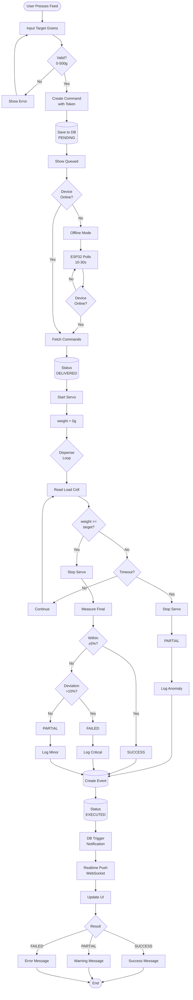

# Activity Diagram - Closed-Loop Feeding Control

```mermaid
flowchart TD
    Start([User Presses Feed]) --> Input[Input Target Grams]
    Input --> Valid{Valid?<br/>0-500g}
    
    Valid -->|No| Error[Show Error]
    Error --> Input
    
    Valid -->|Yes| CreateCmd[Create Command<br/>with Token]
    CreateCmd --> SaveDB[(Save to DB<br/>PENDING)]
    SaveDB --> ShowQueued[Show Queued]
    
    ShowQueued --> CheckOnline{Device<br/>Online?}
    
    CheckOnline -->|No| WaitMode[Offline Mode]
    WaitMode --> Poll[ESP32 Polls<br/>10-30s]
    Poll --> DeviceUp{Device<br/>Online?}
    DeviceUp -->|No| Poll
    DeviceUp -->|Yes| Fetch
    
    CheckOnline -->|Yes| Fetch[Fetch Commands]
    
    Fetch --> UpdateDel[(Status<br/>DELIVERED)]
    UpdateDel --> StartServo[Start Servo]
    
    StartServo --> InitWeight[weight = 0g]
    InitWeight --> Loop{Dispense<br/>Loop}
    
    Loop --> ReadWeight[Read Load Cell]
    ReadWeight --> CheckTarget{weight >=<br/>target?}
    
    CheckTarget -->|No| CheckTimeout{Timeout?}
    CheckTimeout -->|No| Continue[Continue]
    Continue --> ReadWeight
    
    CheckTimeout -->|Yes| TimeoutStop[Stop Servo]
    TimeoutStop --> MarkPartial[PARTIAL]
    MarkPartial --> LogAnomaly[Log Anomaly]
    LogAnomaly --> Record
    
    CheckTarget -->|Yes| Stop[Stop Servo]
    Stop --> Measure[Measure Final]
    
    Measure --> CheckTol{Within<br/>±5%?}
    
    CheckTol -->|Yes| MarkSuccess[SUCCESS]
    MarkSuccess --> Record[(Create Event)]
    
    CheckTol -->|No| CheckSig{Deviation<br/>>10%?}
    
    CheckSig -->|Yes| MarkFailed[FAILED]
    MarkFailed --> LogCritical[Log Critical]
    LogCritical --> Record
    
    CheckSig -->|No| MarkPartial2[PARTIAL]
    MarkPartial2 --> LogMinor[Log Minor]
    LogMinor --> Record
    
    Record --> UpdateExec[(Status<br/>EXECUTED)]
    UpdateExec --> Trigger[DB Trigger<br/>Notification]
    
    Trigger --> Realtime[Realtime Push<br/>WebSocket]
    Realtime --> UpdateUI[Update UI]
    
    UpdateUI --> ShowResult{Result}
    
    ShowResult -->|SUCCESS| ShowSuccess[Success Message]
    ShowResult -->|PARTIAL| ShowPartial[Warning Message]
    ShowResult -->|FAILED| ShowFailed[Error Message]
    
    ShowSuccess --> End([End])
    ShowPartial --> End
    ShowFailed --> End
```
