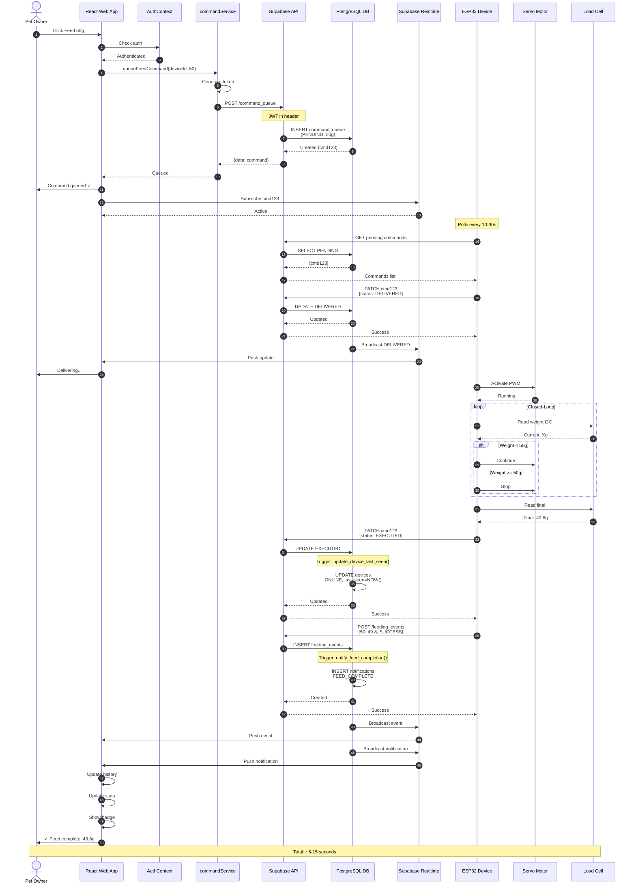

# Sequence Diagram - Feed Command Flow

```mermaid
sequenceDiagram
    autonumber
    actor User as Pet Owner
    participant WebApp as React Web App
    participant Auth as AuthContext
    participant CmdSvc as commandService
    participant SupaAPI as Supabase API
    participant DB as PostgreSQL DB
    participant Realtime as Supabase Realtime
    participant ESP32 as ESP32 Device
    participant Servo as Servo Motor
    participant LoadCell as Load Cell
    
    User->>WebApp: Click Feed 50g
    WebApp->>Auth: Check auth
    Auth-->>WebApp: Authenticated
    
    WebApp->>CmdSvc: queueFeedCommand(deviceId, 50)
    CmdSvc->>CmdSvc: Generate token
    
    CmdSvc->>SupaAPI: POST /command_queue
    Note over SupaAPI: JWT in header
    SupaAPI->>DB: INSERT command_queue<br/>(PENDING, 50g)
    DB-->>SupaAPI: Created (cmd123)
    SupaAPI-->>CmdSvc: {data: command}
    CmdSvc-->>WebApp: Queued
    
    WebApp->>User: Command queued ✓
    
    WebApp->>Realtime: Subscribe cmd123
    Realtime-->>WebApp: Active
    
    Note over ESP32: Polls every 10-30s
    ESP32->>SupaAPI: GET pending commands
    SupaAPI->>DB: SELECT PENDING
    DB-->>SupaAPI: [cmd123]
    SupaAPI-->>ESP32: Commands list
    
    ESP32->>SupaAPI: PATCH cmd123<br/>{status: DELIVERED}
    SupaAPI->>DB: UPDATE DELIVERED
    DB-->>SupaAPI: Updated
    SupaAPI-->>ESP32: Success
    
    DB->>Realtime: Broadcast DELIVERED
    Realtime->>WebApp: Push update
    WebApp->>User: Delivering...
    
    ESP32->>Servo: Activate PWM
    Servo-->>ESP32: Running
    
    loop Closed-Loop
        ESP32->>LoadCell: Read weight I2C
        LoadCell-->>ESP32: Current: Xg
        
        alt Weight < 50g
            ESP32->>Servo: Continue
        else Weight >= 50g
            ESP32->>Servo: Stop
        end
    end
    
    ESP32->>LoadCell: Read final
    LoadCell-->>ESP32: Final: 49.8g
    
    ESP32->>SupaAPI: PATCH cmd123<br/>{status: EXECUTED}
    SupaAPI->>DB: UPDATE EXECUTED
    
    Note over DB: Trigger: update_device_last_seen()
    DB->>DB: UPDATE devices<br/>ONLINE, last_seen=NOW()
    
    DB-->>SupaAPI: Updated
    SupaAPI-->>ESP32: Success
    
    ESP32->>SupaAPI: POST /feeding_events<br/>{50, 49.8, SUCCESS}
    SupaAPI->>DB: INSERT feeding_events
    
    Note over DB: Trigger: notify_feed_completion()
    DB->>DB: INSERT notifications<br/>FEED_COMPLETE
    
    DB-->>SupaAPI: Created
    SupaAPI-->>ESP32: Success
    
    DB->>Realtime: Broadcast event
    Realtime->>WebApp: Push event
    
    DB->>Realtime: Broadcast notification
    Realtime->>WebApp: Push notification
    
    WebApp->>WebApp: Update history
    WebApp->>WebApp: Update stats
    WebApp->>WebApp: Show badge
    
    WebApp->>User: ✓ Feed complete: 49.8g
    
    Note over User,LoadCell: Total: ~5-15 seconds
```
