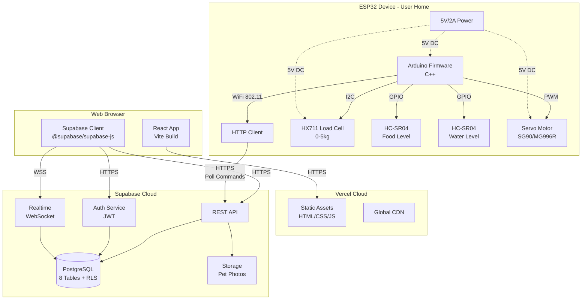

# Deployment Diagram - Physical Architecture

```mermaid
graph TB
    subgraph Browser[Web Browser]
        ReactApp[React App<br/>Vite Build]
        SupaClient[Supabase Client<br/>@supabase/supabase-js]
    end
    
    subgraph Vercel[Vercel Cloud]
        Static[Static Assets<br/>HTML/CSS/JS]
        CDN[Global CDN]
    end
    
    subgraph Supabase[Supabase Cloud]
        REST[REST API]
        Auth[Auth Service<br/>JWT]
        Realtime[Realtime<br/>WebSocket]
        DB[(PostgreSQL<br/>8 Tables + RLS)]
        Storage[Storage<br/>Pet Photos]
    end
    
    subgraph ESP32Device[ESP32 Device - User Home]
        Firmware[Arduino Firmware<br/>C++]
        HTTPClient[HTTP Client]
        
        LoadCell[HX711 Load Cell<br/>0-5kg]
        Ultrasonic1[HC-SR04<br/>Food Level]
        Ultrasonic2[HC-SR04<br/>Water Level]
        Servo[Servo Motor<br/>SG90/MG996R]
        Power[5V/2A Power]
    end
    
    ReactApp -->|HTTPS| Static
    SupaClient -->|HTTPS| REST
    SupaClient -->|WSS| Realtime
    SupaClient -->|HTTPS| Auth
    
    REST --> DB
    Auth --> DB
    Realtime --> DB
    REST --> Storage
    
    HTTPClient -->|HTTPS<br/>Poll Commands| REST
    Firmware -->|WiFi 802.11| HTTPClient
    
    Firmware -->|I2C| LoadCell
    Firmware -->|GPIO| Ultrasonic1
    Firmware -->|GPIO| Ultrasonic2
    Firmware -->|PWM| Servo
    
    Power -.->|5V DC| Firmware
    Power -.->|5V DC| LoadCell
    Power -.->|5V DC| Servo
```
