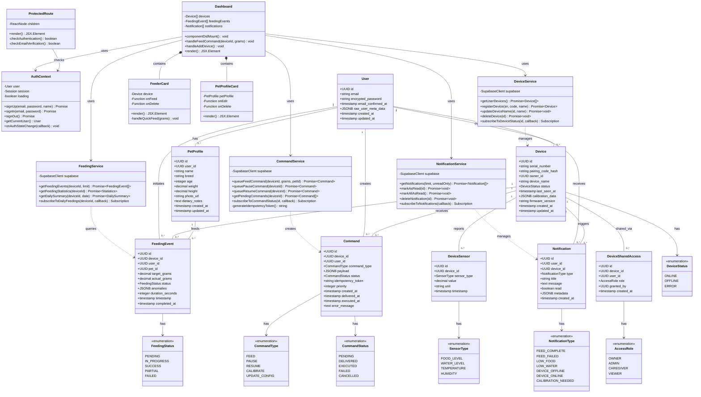

# Class Diagram

```mermaid
classDiagram
    direction TB
    
    %% Frontend Classes
    class AuthContext {
        -User user
        -Session session
        -boolean loading
        +signUp(email, password, name) Promise
        +signIn(email, password) Promise
        +signOut() Promise
        +getCurrentUser() User
        +onAuthStateChange(callback) void
    }
    
    class DeviceService {
        -SupabaseClient supabase
        +getUserDevices() Promise~Device[]~
        +registerDevice(sn, code, name) Promise~Device~
        +updateDeviceName(id, name) Promise~void~
        +deleteDevice(id) Promise~void~
        +subscribeToDeviceStatus(id, callback) Subscription
    }
    
    class CommandService {
        -SupabaseClient supabase
        +queueFeedCommand(deviceId, grams, petId) Promise~Command~
        +queuePauseCommand(deviceId) Promise~Command~
        +queueResumeCommand(deviceId) Promise~Command~
        +getPendingCommands(deviceId) Promise~Command[]~
        +subscribeToCommandStatus(id, callback) Subscription
        -generateIdempotencyToken() string
    }
    
    class FeedingService {
        -SupabaseClient supabase
        +getFeedingEvents(deviceId, limit) Promise~FeedingEvent[]~
        +getFeedingStatistics(deviceId) Promise~Statistics~
        +getDailySummary(deviceId, date) Promise~DailySummary~
        +subscribeToDailyFeedings(deviceId, callback) Subscription
    }
    
    class NotificationService {
        -SupabaseClient supabase
        +getNotifications(limit, unreadOnly) Promise~Notification[]~
        +markAsRead(id) Promise~void~
        +markAllAsRead() Promise~void~
        +deleteNotification(id) Promise~void~
        +subscribeToNotifications(callback) Subscription
    }
    
    class Dashboard {
        -Device[] devices
        -FeedingEvent[] feedingEvents
        -Notification[] notifications
        +componentDidMount() void
        +handleFeedCommand(deviceId, grams) void
        +handleAddDevice() void
        +render() JSX.Element
    }
    
    class FeederCard {
        -Device device
        -Function onFeed
        -Function onDelete
        +render() JSX.Element
        -handleQuickFeed(grams) void
    }
    
    class PetProfileCard {
        -PetProfile petProfile
        -Function onEdit
        -Function onDelete
        +render() JSX.Element
    }
    
    class ProtectedRoute {
        -ReactNode children
        +render() JSX.Element
        -checkAuthentication() boolean
        -checkEmailVerification() boolean
    }
    
    %% Backend Entities
    class User {
        +UUID id
        +string email
        +string encrypted_password
        +timestamp email_confirmed_at
        +JSONB raw_user_meta_data
        +timestamp created_at
        +timestamp updated_at
    }
    
    class Device {
        +UUID id
        +string serial_number
        +string pairing_code_hash
        +UUID owner_id
        +string device_name
        +DeviceStatus status
        +timestamp last_seen_at
        +JSONB calibration_data
        +string firmware_version
        +timestamp created_at
        +timestamp updated_at
    }
    
    class PetProfile {
        +UUID id
        +UUID user_id
        +string name
        +string breed
        +integer age
        +decimal weight
        +decimal height
        +string photo_url
        +text dietary_notes
        +timestamp created_at
        +timestamp updated_at
    }
    
    class FeedingEvent {
        +UUID id
        +UUID device_id
        +UUID user_id
        +UUID pet_id
        +decimal target_grams
        +decimal actual_grams
        +FeedingStatus status
        +JSONB anomalies
        +integer duration_seconds
        +timestamp timestamp
        +timestamp completed_at
    }
    
    class Command {
        +UUID id
        +UUID device_id
        +UUID user_id
        +CommandType command_type
        +JSONB payload
        +CommandStatus status
        +string idempotency_token
        +integer priority
        +timestamp created_at
        +timestamp delivered_at
        +timestamp executed_at
        +text error_message
    }
    
    class Notification {
        +UUID id
        +UUID user_id
        +UUID device_id
        +NotificationType type
        +string title
        +text message
        +boolean read
        +JSONB metadata
        +timestamp created_at
    }
    
    class DeviceSensor {
        +UUID id
        +UUID device_id
        +SensorType sensor_type
        +decimal value
        +string unit
        +timestamp timestamp
    }
    
    class DeviceSharedAccess {
        +UUID id
        +UUID device_id
        +UUID user_id
        +AccessRole role
        +UUID granted_by
        +timestamp created_at
    }
    
    %% Enumerations
    class DeviceStatus {
        <<enumeration>>
        ONLINE
        OFFLINE
        ERROR
    }
    
    class FeedingStatus {
        <<enumeration>>
        PENDING
        IN_PROGRESS
        SUCCESS
        PARTIAL
        FAILED
    }
    
    class CommandType {
        <<enumeration>>
        FEED
        PAUSE
        RESUME
        CALIBRATE
        UPDATE_CONFIG
    }
    
    class CommandStatus {
        <<enumeration>>
        PENDING
        DELIVERED
        EXECUTED
        FAILED
        CANCELLED
    }
    
    class NotificationType {
        <<enumeration>>
        FEED_COMPLETE
        FEED_FAILED
        LOW_FOOD
        LOW_WATER
        DEVICE_OFFLINE
        DEVICE_ONLINE
        CALIBRATION_NEEDED
    }
    
    class SensorType {
        <<enumeration>>
        FOOD_LEVEL
        WATER_LEVEL
        TEMPERATURE
        HUMIDITY
    }
    
    class AccessRole {
        <<enumeration>>
        OWNER
        ADMIN
        CAREGIVER
        VIEWER
    }
    
    %% Frontend Relationships
    Dashboard --> AuthContext : uses
    Dashboard --> DeviceService : uses
    Dashboard --> CommandService : uses
    Dashboard --> FeedingService : uses
    Dashboard --> NotificationService : uses
    Dashboard *-- FeederCard : contains
    Dashboard *-- PetProfileCard : contains
    ProtectedRoute --> AuthContext : checks
    
    %% Service to Entity
    DeviceService ..> Device : manages
    CommandService ..> Command : creates
    FeedingService ..> FeedingEvent : queries
    NotificationService ..> Notification : manages
    
    %% Backend Relationships
    User "1" -- "0..*" Device : owns
    User "1" -- "0..*" PetProfile : has
    User "1" -- "0..*" Notification : receives
    User "1" -- "0..*" FeedingEvent : initiates
    User "1" -- "0..*" Command : creates
    
    Device "1" -- "0..*" FeedingEvent : logs
    Device "1" -- "0..*" Command : receives
    Device "1" -- "0..*" DeviceSensor : reports
    Device "1" -- "0..*" Notification : triggers
    Device "1" -- "0..*" DeviceSharedAccess : shared_via
    
    PetProfile "1" -- "0..*" FeedingEvent : feeds
    
    %% Enum Relationships
    Device --> DeviceStatus : has
    FeedingEvent --> FeedingStatus : has
    Command --> CommandType : has
    Command --> CommandStatus : has
    Notification --> NotificationType : has
    DeviceSensor --> SensorType : has
    DeviceSharedAccess --> AccessRole : has
```
