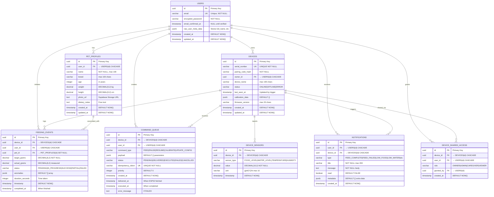

# Entity Relationship Diagram

```mermaid
erDiagram
    %% Relationships with proper cardinality notation
    USERS ||--o{ DEVICES : "owns"
    USERS ||--o{ PET_PROFILES : "has"
    USERS ||--o{ FEEDING_EVENTS : "initiates"
    USERS ||--o{ COMMAND_QUEUE : "creates"
    USERS ||--o{ NOTIFICATIONS : "receives"
    USERS ||--o{ DEVICE_SHARED_ACCESS : "grants"
    
    DEVICES ||--o{ FEEDING_EVENTS : "logs"
    DEVICES ||--o{ COMMAND_QUEUE : "receives"
    DEVICES ||--o{ DEVICE_SENSORS : "reports"
    DEVICES ||--o{ NOTIFICATIONS : "triggers"
    DEVICES ||--o{ DEVICE_SHARED_ACCESS : "shared_via"
    
    PET_PROFILES ||--o{ FEEDING_EVENTS : "associated_with"
    
    %% Entity Definitions with Attributes
    USERS {
        uuid id PK "Primary Key"
        varchar email UK "Unique, NOT NULL"
        varchar encrypted_password "NOT NULL"
        timestamp email_confirmed_at "NULL until verified"
        jsonb raw_user_meta_data "Stores full_name, etc"
        timestamp created_at "DEFAULT NOW()"
        timestamp updated_at "DEFAULT NOW()"
    }
    
    DEVICES {
        uuid id PK "Primary Key"
        varchar serial_number UK "UNIQUE NOT NULL"
        varchar pairing_code_hash "NOT NULL"
        uuid owner_id FK "→ USERS(id) CASCADE"
        varchar device_name "max 100 chars"
        varchar status "ONLINE|OFFLINE|ERROR"
        timestamp last_seen_at "Updated by trigger"
        jsonb calibration_data "DEFAULT {}"
        varchar firmware_version "max 20 chars"
        timestamp created_at "DEFAULT NOW()"
        timestamp updated_at "DEFAULT NOW()"
    }
    
    PET_PROFILES {
        uuid id PK "Primary Key"
        uuid user_id FK "→ USERS(id) CASCADE"
        varchar name "NOT NULL, max 100"
        varchar breed "max 100 chars"
        integer age "in years"
        decimal weight "DECIMAL(5,2) kg"
        decimal height "DECIMAL(5,2) cm"
        text photo_url "Supabase Storage URL"
        text dietary_notes "Free text"
        timestamp created_at "DEFAULT NOW()"
        timestamp updated_at "DEFAULT NOW()"
    }
    
    FEEDING_EVENTS {
        uuid id PK "Primary Key"
        uuid device_id FK "→ DEVICES(id) CASCADE"
        uuid user_id FK "→ USERS(id) CASCADE"
        uuid pet_id FK "→ PET_PROFILES(id) SET NULL"
        decimal target_grams "DECIMAL(6,2) NOT NULL"
        decimal actual_grams "DECIMAL(6,2) measured"
        varchar status "PENDING|IN_PROGRESS|SUCCESS|PARTIAL|FAILED"
        jsonb anomalies "DEFAULT [] array"
        integer duration_seconds "Time taken"
        timestamp timestamp "DEFAULT NOW()"
        timestamp completed_at "When finished"
    }
    
    COMMAND_QUEUE {
        uuid id PK "Primary Key"
        uuid device_id FK "→ DEVICES(id) CASCADE"
        uuid user_id FK "→ USERS(id) CASCADE"
        varchar command_type "FEED|PAUSE|RESUME|CALIBRATE|UPDATE_CONFIG"
        jsonb payload "DEFAULT {} parameters"
        varchar status "PENDING|DELIVERED|EXECUTED|FAILED|CANCELLED"
        varchar idempotency_token UK "UNIQUE NOT NULL"
        integer priority "DEFAULT 0"
        timestamp created_at "DEFAULT NOW()"
        timestamp delivered_at "When ESP32 fetched"
        timestamp executed_at "When completed"
        text error_message "If FAILED"
    }
    
    NOTIFICATIONS {
        uuid id PK "Primary Key"
        uuid user_id FK "→ USERS(id) CASCADE"
        uuid device_id FK "→ DEVICES(id) CASCADE"
        varchar type "FEED_COMPLETE|FEED_FAILED|LOW_FOOD|LOW_WATER|etc"
        varchar title "NOT NULL max 200"
        text message "NOT NULL body"
        boolean read "DEFAULT FALSE"
        jsonb metadata "DEFAULT {} extra data"
        timestamp created_at "DEFAULT NOW()"
    }
    
    DEVICE_SENSORS {
        uuid id PK "Primary Key"
        uuid device_id FK "→ DEVICES(id) CASCADE"
        varchar sensor_type "FOOD_LEVEL|WATER_LEVEL|TEMPERATURE|HUMIDITY"
        decimal value "DECIMAL(10,2) NOT NULL"
        varchar unit "g|ml|°C|% max 10"
        timestamp timestamp "DEFAULT NOW()"
    }
    
    DEVICE_SHARED_ACCESS {
        uuid id PK "Primary Key"
        uuid device_id FK "→ DEVICES(id) CASCADE"
        uuid user_id FK "→ USERS(id) CASCADE"
        varchar role "OWNER|ADMIN|CAREGIVER|VIEWER"
        uuid granted_by FK "→ USERS(id)"
        timestamp created_at "DEFAULT NOW()"
    }
```
