# Deep Functional Decomposition & SRS Specifications

## 1. Functional Decomposition Tree (FDD)
This diagram provides a multi-level view of the system's capabilities, breaking down high-level goal into specific operational modules.

```mermaid
graph TD
    System["Smart Pet Feeder System"]

    %% Subsystem 1: User & Pet Management
    S1["Subsystem 1: User & Pet Management"]
    System --- S1
    
    S1 --- S1_F1["Feature 1: User Authentication"]
    S1_F1 --- S1_F1_1["Account Lifecycle (Reg/Verify)"]
    S1_F1 --- S1_F1_2["Session Layer (JWT/Auth)"]
    S1_F1 --- S1_F1_3["Security (PW Reset/MFA)"]
    
    S1 --- S1_F2["Feature 2: Profile & Identity"]
    S1_F2 --- S1_F2_1["User Personalization"]
    S1_F2 --- S1_F2_2["Credential Management"]
    
    S1 --- S1_F3["Feature 3: Pet Management"]
    S1_F3 --- S1_F3_1["Biological Registry (Stats)"]
    S1_F3 --- S1_F3_2["Health Tracking (Weight)"]
    S1_F3 --- S1_F3_3["Photo Artifact Storage"]

    %% Subsystem 2: Feeding & Monitoring logic
    S2["Subsystem 2: Feeding & Analytics"]
    System --- S2
    
    S2 --- S2_F4["Feature 4: Feeding Protocols"]
    S2_F4 --- S2_F4_1["Manual Precision Dispatch"]
    S2_F4 --- S2_F4_2["Scheduler (Cron Recurring)"]
    S2_F4 --- S2_F4_3["Buffer (Offline Queue)"]
    
    S2 --- S2_F5["Feature 5: Monitoring Engine"]
    S2_F5 --- S2_F5_1["Real-time Scale Telemetry"]
    S2_F5 --- S2_F5_2["Resource Level Sensing (F/W)"]
    
    S2 --- S2_F6["Feature 6: Analytics & Reports"]
    S2_F6 --- S2_F6_1["Consumption Pattern Analysis"]
    S2_F6 --- S2_F6_2["Statistical Visualization"]
    S2_F6 --- S2_F6_3["Data Export Modules"]

    %% Subsystem 3: IoT Connectivity & Alerts
    S3["Subsystem 3: IoT & Communication"]
    System --- S3
    
    S3 --- S3_F7["Feature 7: Device Lifecycle"]
    S3_F7 --- S3_F7_1["Secure Pairing (S/N + Code)"]
    S3_F7 --- S3_F7_2["Firmware Registry & Tracking"]
    
    S3 --- S3_F8["Feature 8: Hardware Loop (Closed-Loop)"]
    S3_F8 --- S3_F8_1["PWM Servo Actuation"]
    S3_F8 --- S3_F8_2["Feedback (HX711 Scaling)"]
    S3_F8 --- S3_F8_3["Anomaly Logic (Stall Detect)"]
    
    S3 --- S3_F9["Feature 9: Notification Mesh"]
    S3_F9 --- S3_F9_1["Operational Alerts"]
    S3_F9 --- S3_F9_2["Critical Supply Alerts"]
    S3_F9 --- S3_F9_3["Device Status Notifications"]

    %% Styling
    classDef system fill:#2c3e50,color:#fff,stroke-width:4px;
    classDef subsys fill:#ecf0f1,stroke:#2c3e50,stroke-width:3px;
    classDef feature fill:#fff,stroke:#34495e,stroke-width:2px;
    classDef leaf fill:#fff,stroke:#7f8c8d,stroke-dasharray: 5 5;
    
    class System system;
    class S1,S2,S3 subsys;
    class S1_F1,S1_F2,S1_F3,S2_F4,S2_F5,S2_F6,S3_F7,S3_F8,S3_F9 feature;
    class S1_F1_1,S1_F1_2,S1_F1_3,S1_F2_1,S1_F2_2,S1_F3_1,S1_F3_2,S1_F3_3 leaf;
    class S2_F4_1,S2_F4_2,S2_F4_3,S2_F5_1,S2_F5_2,S2_F6_1,S2_F6_2,S2_F6_3 leaf;
    class S3_F7_1,S3_F7_2,S3_F8_1,S3_F8_2,S3_F8_3,S3_F9_1,S3_F9_2,S3_F9_3 leaf;
```

---

## 2. Hierarchical SRS Tracking Specification
This table breaks down requirements by Feature Grouping for granular tracking.

### 2.1 Subsystem 1: User & Pet Management
| Feature ID | ID No. | Requirement | Type | Progress |
| :--- | :--- | :--- | :--- | :--- |
| **F1: Auth** | S1.F1.R1 | Secure Email/PW Registration & Verification | Func | ●●●●● |
| | S1.F1.R2 | JWT-based Auth & Middleware Protection | Tech | ●●●●● |
| | S1.F1.R3 | SMTP-integrated Password Recovery Service | Func | ●●●●● |
| **F2: Identity**| S1.F2.R1 | Multi-tenant User Profile Management | Usability| ●●●●● |
| | S1.F2.R2 | DB-Level Row-Level Security (RLS) | Security| ●●●●● |
| **F3: Pet** | S1.F3.R1 | Dynamic Pet Registry (Medical Meta) | Func | ●●●●● |
| | S1.F3.R2 | Interactive Weight History Log | Analytical| ●●●●○ |
| | S1.F3.R3 | Cloud-Storage Photo Upload (Supabase) | Tech | ●●●●● |

### 2.2 Subsystem 2: Feeding, Monitoring & Analytics
| Feature ID | ID No. | Requirement | Type | Progress |
| :--- | :--- | :--- | :--- | :--- |
| **F4: Feeding** | S2.F4.R1 | High-Precision Manual Feeding Logic | Func | ●●●●● |
| | S2.F4.R2 | Multi-Schedule Recurring Engine (Cron) | Func | ●●●●○ |
| | S2.F4.R3 | Offline Command Persistence & Queuing | Reliable| ●●●●● |
| **F5: Sensing** | S2.F5.R1 | Real-time Load Cell Telemetry Sync | Realtime| ●●●○ ○ |
| | S2.F5.R2 | Multi-point Fluid/Food Level Detection | Tech | ●●●●○ |
| **F6: Analytics**| S2.F6.R1 | Daily/Weekly Consumption Summary | Analytical| ●●●●○ |
| | S2.F6.R2 | Anomaly Visual Reporting Patterns | Analytical| ●●●○ ○ |

### 2.3 Subsystem 3: IoT Device & Communication
| Feature ID | ID No. | Requirement | Type | Progress |
| :--- | :--- | :--- | :--- | :--- |
| **F7: Device** | S3.F7.R1 | Hardware Pairing via Unique SN/Hashed Code | Security| ●●●●● |
| | S3.F7.R2 | Firmware Versioning & OTA Readiness Logic | Tech | ●●●●○ |
| **F8: Loop** | S3.F8.R1 | PWM-based Precision Dispensing | Hardware| ●●●●● |
| | S3.F8.R2 | Continuous Scale Feedback During Dispense | FYP Core| ●●●●○ |
| | S3.F8.R3 | Motor Stall & Empty Hopper Intelligence | Reliable| ●●●○ ○ |
| **F9: Alerts** | S3.F9.R1 | Global Push Notification Mesh | Usability| ●●●●○ |
| | S3.F9.R2 | Device Status/Heartbeat Change Alerts | Tech | ●●●●○ |

> [!TIP]
> **Progress Legend:**
> - `●●●●●` : Completed & Validated
> - `●●●●○` : Feature Ready, Optimization Ongoing
> - `●●●○ ○` : Structural Integration Stage
