# FINAL SYSTEM DESIGN REPORT: SMART PET FEEDER SYSTEM

**Date:** January 3, 2026  
**Project:** Smart Pet Feeder (FYP)  
**Author:** Adarsha Prasai  

---

## 1. Introduction
This report provides a comprehensive design and architectural overviews of the "Smart Pet Feeder" system. It decomposes the system into three primary logical subsystems, details the functional and non-functional requirements in a hierarchical feature-driven model, and provides a series of UML and architectural diagrams to support the implementation phase.

---

## 2. Requirements & Functional Specification

### 2.1 Functional Decomposition Diagram (FDD)
The following diagram illustrates the hierarchical breakdown of the system functions, providing deep granularity for clear architectural partitioning.

```mermaid
graph TD
    System["Smart Pet Feeder System"]

    %% SUBSYSTEM 1
    S1["Subsystem 1: User & Pet Management"]
    System --- S1

    S1_F1["[S1.F1] User Authentication & Security"]
    S1 --- S1_F1
    S1_F1 --- FR1.1["FR1.1: Registration (Email/PW)"]
    S1_F1 --- FR1.2["FR1.2: Email Verification"]
    S1_F1 --- FR1.3["FR1.3: Mandatory Verification Guard"]
    S1_F1 --- FR1.4["FR1.4: Verified Login Access"]
    S1_F1 --- FR1.5["FR1.5: Password Reset Workflow"]
    S1_F1 --- FR1.6["FR1.6: Profile Metadata Management"]
    S1_F1 --- FR1.7["FR1.7: Secure Logout/Invalidation"]

    S1_F2["[S1.F2] Pet Profile Management"]
    S1 --- S1_F2
    S1_F2 --- FR2.1["FR2.1: Multi-Pet Creation"]
    S1_F2 --- FR2.2["FR2.2: Bio-data Storage"]
    S1_F2 --- FR2.3["FR2.3: Cloud Photography"]
    S1_F2 --- FR2.4["FR2.4: Attribute Editing"]
    S1_F2 --- FR2.5["FR2.5: Secure Deletion"]
    S1_F2 --- FR2.6["FR2.6: Detail Dashboard Interface"]

    %% SUBSYSTEM 2
    S2["Subsystem 2: Feeding, Monitoring & Analytics"]
    System --- S2

    S2_F4["[S2.F4] Feeding Operations & Scheduler"]
    S2 --- S2_F4
    S2_F4 --- FR4.1["FR4.1: Manual Dispense Trigger"]
    S2_F4 --- FR4.2["FR4.2: Gram Logic (0-500g)"]
    S2_F4 --- FR4.3["FR4.3: Recurring Cron Cycles"]
    S2_F4 --- FR4.4["FR4.4: Schedule Management"]
    S2_F4 --- FR4.6["FR4.6: Offline Command Queue"]
    S2_F4 --- FR4.8["FR4.8: Dispense Monitoring UI"]
    S2_F4 --- FR4.9["FR4.9: Target vs Actual Audit"]

    S2_F5["[S2.F5] Closed-Loop Control System (Core)"]
    S2 --- S2_F5
    S2_F5 --- FR5.1["FR5.1: Real-time Weight Feedback"]
    S2_F5 --- FR5.2["FR5.2: Precision Motor Cutoff"]
    S2_F5 --- FR5.4["FR5.4: ±5% Tolerance Validation"]
    S2_F5 --- FR5.5["FR5.5: Deviation Alarm (>10%)"]
    S2_F5 --- FR5.7["FR5.7: Database Gram Reporting"]

    S2_F6["[S2.F6] Monitoring & Data Analytics"]
    S2 --- S2_F6
    S2_F6 --- FR6.1["FR6.1: Live Food Level Analysis"]
    S2_F6 --- FR6.2["FR6.2: Live Water Level Analysis"]
    S2_F6 --- FR6.3["FR6.3: Daily Summary Engine"]
    S2_F6 --- FR6.5["FR6.5: KPI Dashboards (Success/Avg)"]
    S2_F6 --- FR6.6["FR6.6: Universal Data Export"]
    S2_F6 --- FR6.7["FR6.7: Anomaly Visualization Engine"]
    S2_F6 --- FR6.8["FR6.8: Smart Stock Alerts"]

    %% SUBSYSTEM 3
    S3["Subsystem 3: IoT, Connectivity & Notifications"]
    System --- S3

    S3_F3["[S3.F3] Device Management & Pairing"]
    S3 --- S3_F3
    S3_F3 --- FR3.1["FR3.1: Secure SN/Code Pairing"]
    S3_F3 --- FR3.4["FR3.4: Connectivity Heartbeat"]
    S3_F3 --- FR3.6["FR3.6: Multi-tenant Device Sharing"]
    S3_F3 --- FR3.8["FR3.8: Remote Load-Cell Calibration"]
    S3_F3 --- FR3.10["FR3.10: Version Lifecycle Logging"]

    S3_F7["[S3.F7] Multi-Channel Notifications"]
    S3 --- S3_F7
    S3_F7 --- FR7.1["FR7.1: Dispense Success Alerts"]
    S3_F7 --- FR7.2["FR7.2: Hardware Failure Warnings"]
    S3_F7 --- FR7.3["FR7.3: Critical Low-Stock Notifs"]
    S3_F7 --- FR7.5["FR7.5: Offline/Online State Push"]
    S3_F7 --- FR7.8["FR7.8: User Preference Profiles"]

    S3_F8["[S3.F8] IoT Polling & Real-time Ops"]
    S3 --- S3_F8
    S3_F8 --- FR8.1["FR8.1: Adaptive Polling (10-30s)"]
    S3_F8 --- FR8.4["FR8.4: Quad-Sensor Telemetry"]
    S3_F8 --- FR8.8["FR8.8: PENDING-to-EXECUTED Flow"]

    %% SYSTEM-WIDE NODES
    SQ["System Quality & Constraints"]
    System --- SQ
    SQ --- NFR["Non-Functional Requirements"]
    NFR --- NFR1.1["NFR1.1: 2s Latency Baseline"]
    NFR --- NFR2.1["NFR2.1: 99.9% Availability"]
    NFR --- NFR3.2["NFR3.2: TLS 1.3 Encryption"]
    NFR --- NFR3.3["NFR3.3: Row-Level Security"]
    NFR --- NFR4.5["NFR4.5: Mobile-First UX Parity"]
    
    SQ --- CS["System Constraints"]
    CS --- C1.1["C1.1: React-Supabase Stack"]
    CS --- C1.3["C1.3: ESP32-Servo-PWM Hard"]
    CS --- DBR["Database Architecture"]
    DBR --- DBR1.1["DBR1.1: Multi-tenant Schema"]
    DBR --- DBR2.1["DBR2.1: Logic Triggers"]

    %% Styling
    classDef system fill:#000,color:#fff,stroke-width:4px;
    classDef subsys fill:#f2f2f2,stroke:#000,stroke-width:3px;
    classDef feature fill:#fff,stroke:#333,stroke-width:2px;
    classDef leaf fill:#fff,stroke:#999,stroke-dasharray: 5 5;
    
    class System system;
    class S1,S2,S3,SQ subsys;
    class S1_F1,S1_F2,S2_F4,S2_F5,S2_F6,S3_F3,S3_F7,S3_F8,NFR,CS,DBR feature;
    class FR1.1,FR1.2,FR1.3,FR1.4,FR1.5,FR1.6,FR1.7 leaf;
    class FR2.1,FR2.2,FR2.3,FR2.4,FR2.5,FR2.6 leaf;
    class FR4.1,FR4.2,FR4.3,FR4.4,FR4.6,FR4.8,FR4.9 leaf;
    class FR5.1,FR5.2,FR5.4,FR5.5,FR5.7 leaf;
    class FR6.1,FR6.2,FR6.3,FR6.5,FR6.6,FR6.7,FR6.8 leaf;
    class FR3.1,FR3.4,FR3.6,FR3.8,FR3.10 leaf;
    class FR7.1,FR7.2,FR7.3,FR7.5,FR7.8 leaf;
    class FR8.1,FR8.4,FR8.8 leaf;
    class NFR1.1,NFR2.1,NFR3.2,NFR3.3,NFR4.5 leaf;
    class C1.1,C1.3,DBR1.1,DBR2.1 leaf;
```

### 2.2 Software Requirements Specification (SRS) Tracking
This section tracks core requirements mapped to their respective Hierarchical Feature Groups.

#### 2.2.1 Subsystem 1: User & Pet Management
| Feature ID | ID No. | Requirement | Type | Progress |
| :--- | :--- | :--- | :--- | :--- |
| **F1: Auth** | S1.F1.R1 | Secure Email/PW Registration & Verification | Func | ●●●●● |
| | S1.F1.R2 | JWT-based Auth & Middleware Protection | Tech | ●●●●● |
| | S1.F1.R3 | SMTP-integrated Password Recovery Service | Func | ●●●●● |
| **F2: Identity**| S1.F2.R1 | Multi-tenant User Profile Management | Usability| ●●●●● |
| | S1.F2.R2 | DB-Level Row-Level Security (RLS) | Security| ●●●●● |
| **F3: Pet** | S1.F3.R1 | Dynamic Pet Registry (Medical Meta) | Func | ●●●●● |
| | S1.F3.R2 | Interactive Weight History Log | Analytical| ●●●●○ |
| | S1.F3.R3 | Cloud-Storage Photo Upload (Supabase) | Tech | ●●●●● |

#### 2.2.2 Subsystem 2: Feeding, Monitoring & Analytics
| Feature ID | ID No. | Requirement | Type | Progress |
| :--- | :--- | :--- | :--- | :--- |
| **F4: Feeding** | S2.F4.R1 | High-Precision Manual Feeding Logic | Func | ●●●●● |
| | S2.F4.R2 | Multi-Schedule Recurring Engine (Cron) | Func | ●●●●○ |
| | S2.F4.R3 | Offline Command Persistence & Queuing | Reliable| ●●●●● |
| **F5: Sensing** | S2.F5.R1 | Real-time Load Cell Telemetry Sync | Realtime| ●●●○ ○ |
| | S2.F5.R2 | Multi-point Fluid/Food Level Detection | Tech | ●●●●○ |
| **F6: Analytics**| S2.F6.R1 | Daily/Weekly Consumption Summary | Analytical| ●●●●○ |
| | S2.F6.R2 | Anomaly Visual Reporting Patterns | Analytical| ●●●○ ○ |

#### 2.2.3 Subsystem 3: IoT Device & Communication
| Feature ID | ID No. | Requirement | Type | Progress |
| :--- | :--- | :--- | :--- | :--- |
| **F7: Device** | S3.F7.R1 | Hardware Pairing via Unique SN/Hashed Code | Security| ●●●●● |
| | S3.F7.R2 | Firmware Versioning & OTA Readiness Logic | Tech | ●●●●○ |
| **F8: Loop** | S3.F8.R1 | PWM-based Precision Dispensing | Hardware| ●●●●● |
| | S3.F8.R2 | Continuous Scale Feedback During Dispense | FYP Core| ●●●●○ |
| | S3.F8.R3 | Motor Stall & Empty Hopper Intelligence | Reliable| ●●●○ ○ |
| **F9: Alerts** | S3.F9.R1 | Global Push Notification Mesh | Usability| ●●●●○ |
| | S3.F9.R2 | Device Status/Heartbeat Change Alerts | Tech | ●●●●○ |

---

## 3. Subsystem Decomposition & Modeling

### 3.1 Subsystem A: User & Pet Management
This subsystem handles the identity and metadata of both the users and their pets.

[Figure 1: Use Case Diagram – User & Pet Management]
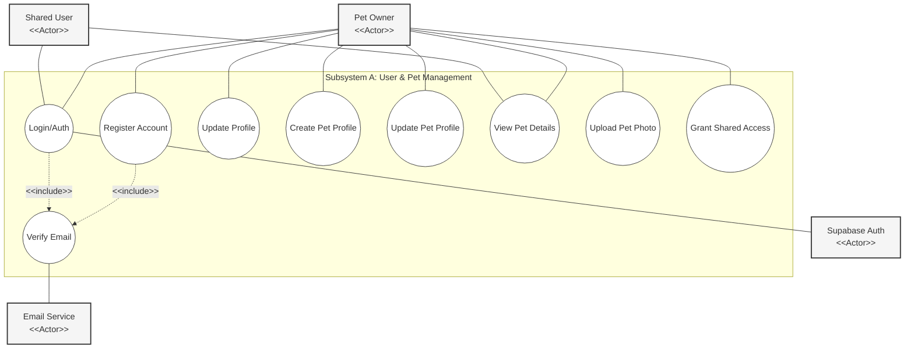

[Figure 2: Sequence Diagram – Registration & Verification]
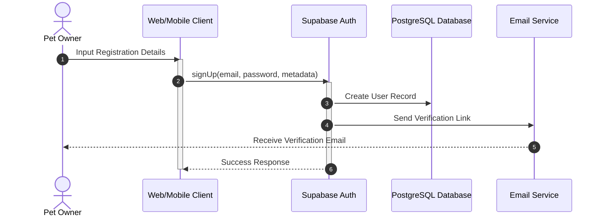

---

### 3.2 Subsystem B: Feeding, Monitoring & Analytics
The core operational logic for dispensing food and analyzing data.

[Figure 3: Use Case Diagram – Feeding & Monitoring]
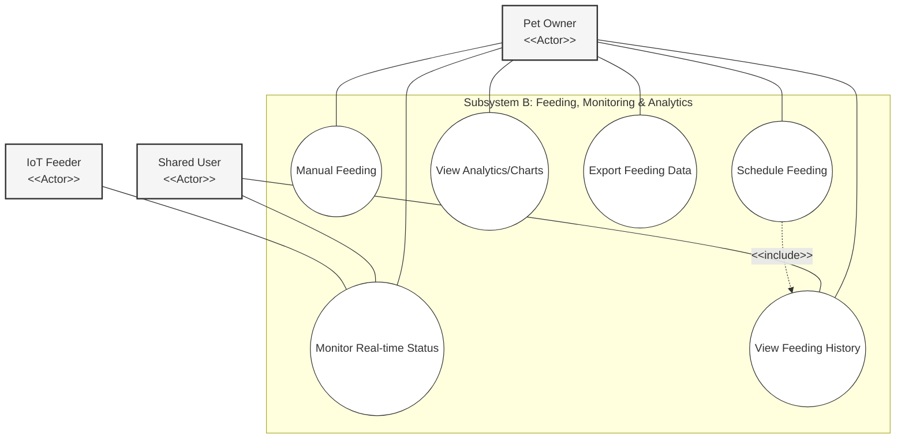

[Figure 4: Sequence Diagram – Closed-Loop Feeding Operation]
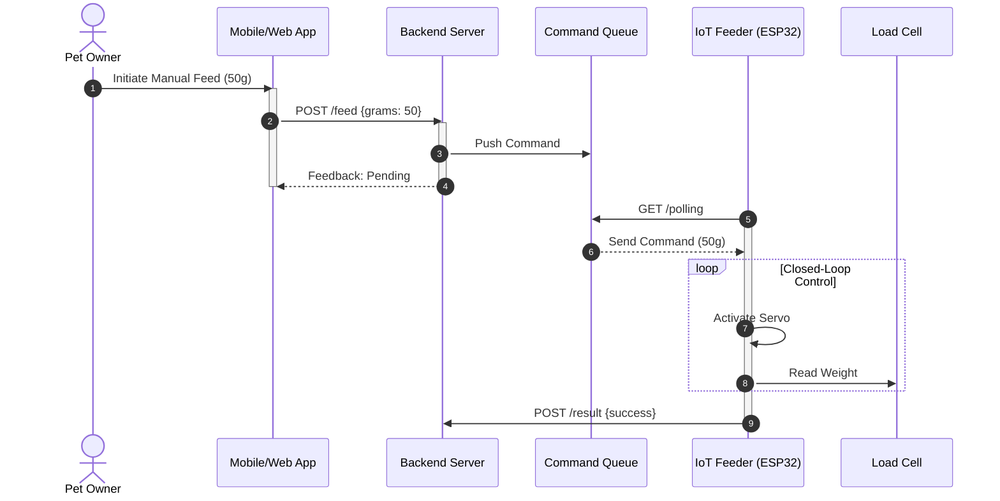

[Figure 5: Activity Diagram – Feeding Execution Workflow]
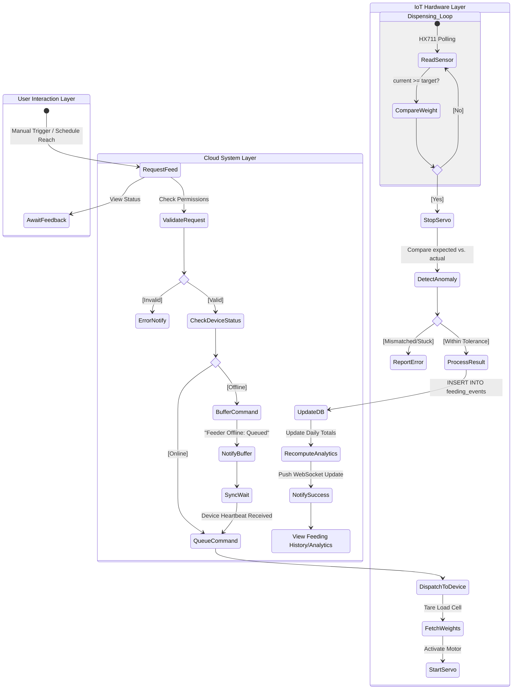

---

### 3.3 Subsystem C: IoT Device & Notifications
Hardware connectivity, sensor polling, and automated user alerting.

[Figure 6: Use Case Diagram – Device & Alerts]
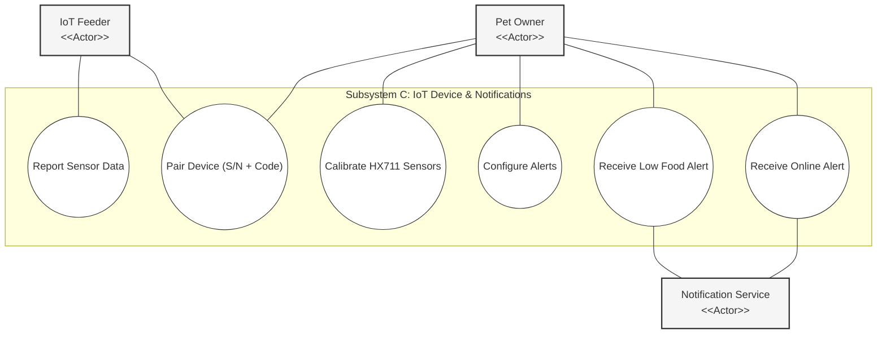

[Figure 7: Sequence Diagram – Device Onboarding & Calibration]
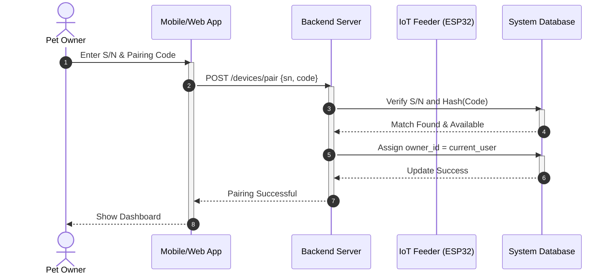

[Figure 8: Activity Diagram – IoT Device Firmware Runtime]
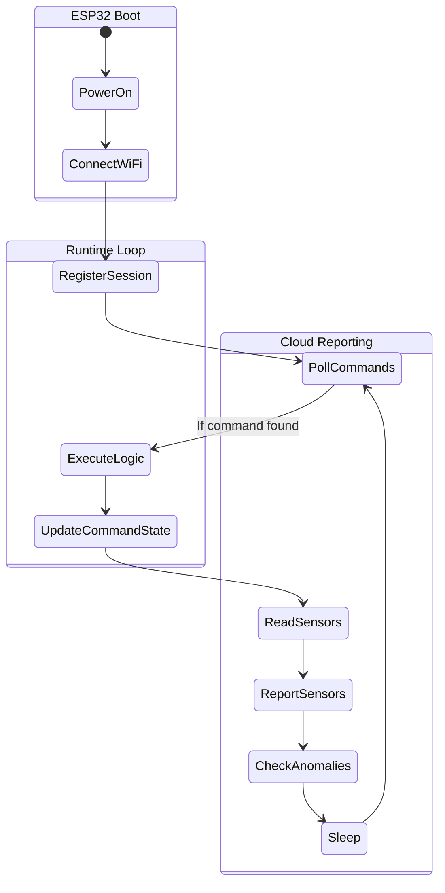

---

## 4. Unified System Diagrams

### 4.1 Data Flow Diagram (DFD Level 1)
[Figure 9: Data Flow Diagram – Functional decomposition]
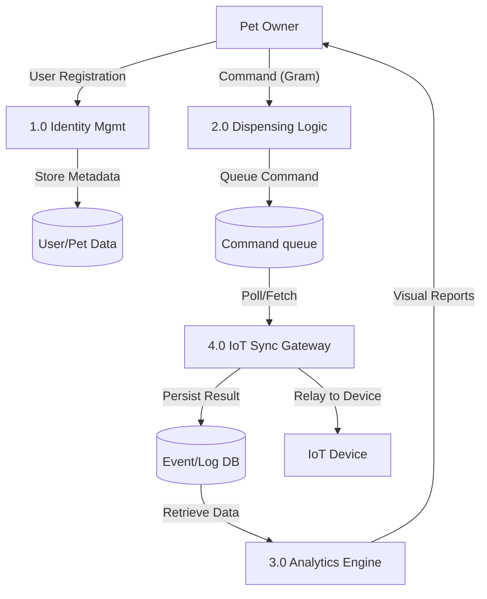

### 4.2 Entity Relationship Diagram (ERD)
[Figure 10: Unified Data Model]
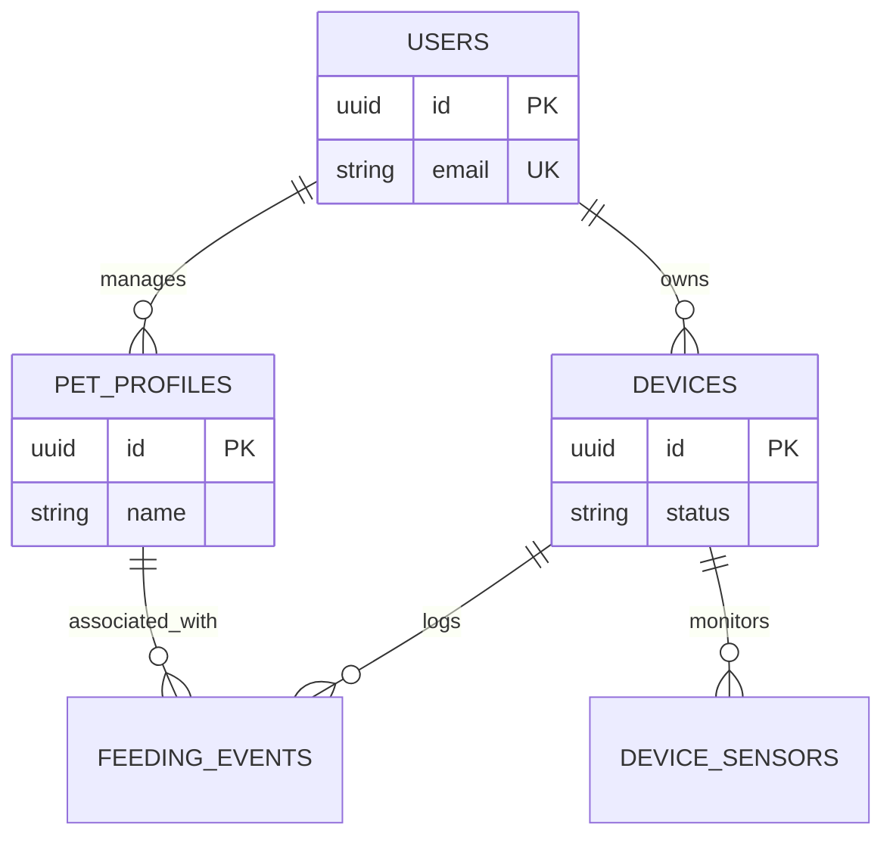

### 4.3 Class Diagram – System Component Architecture
[Figure 11: Class Diagram – System Component Architecture]
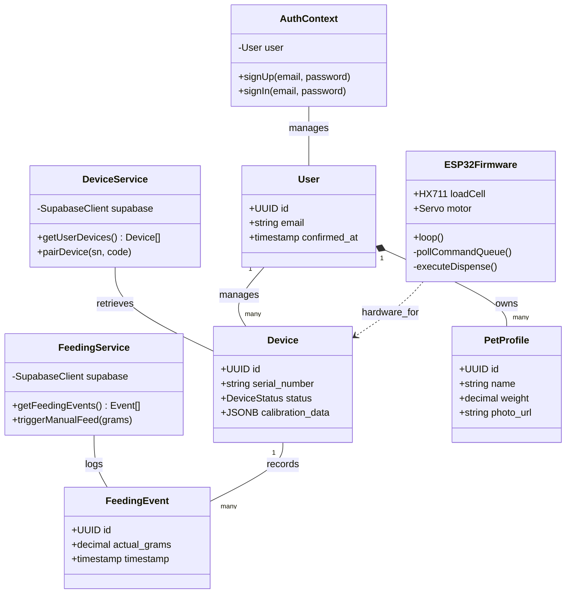

### 4.4 Connectivity Diagram
[Figure 12: Connectivity Diagram – Hardware-Rich Network Topology]
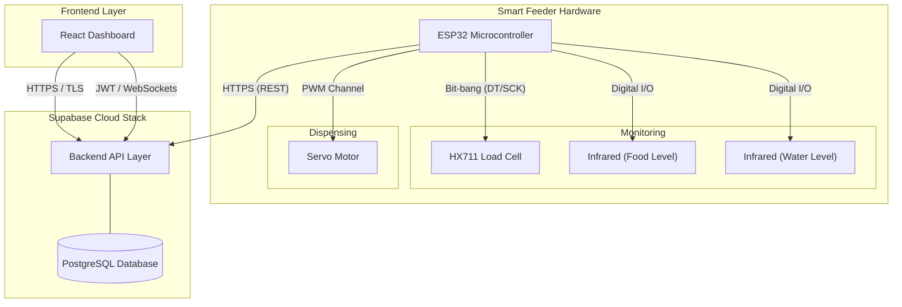

---

## 5. Conclusion
The Smart Pet Feeder system is designed as a robust, secure, and user-friendly IoT solution. By partitioning functionality into three subsystems and following strict UML architectural rules, the design ensures clarity, modularity, and academic defensibility for the Final Year Project.
