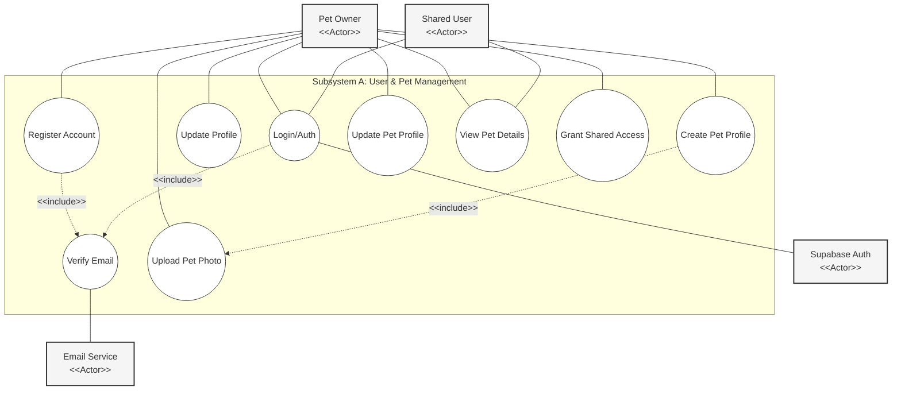
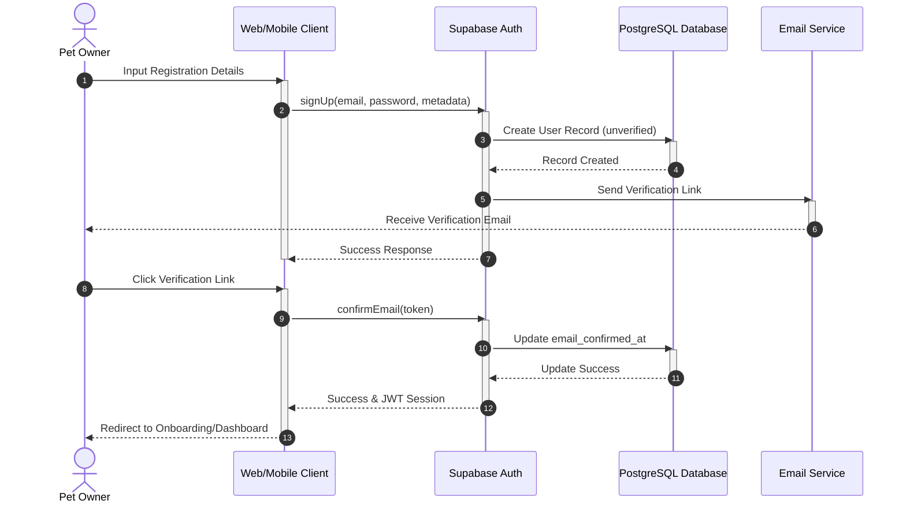
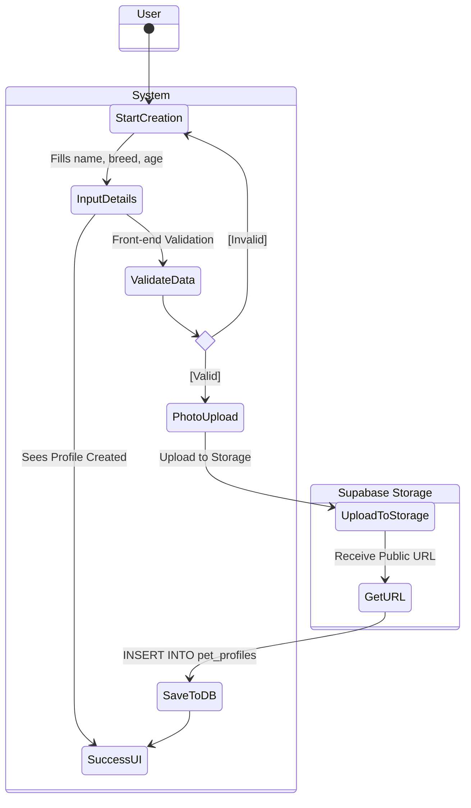

# Subsystem A: User & Pet Management

## 1. Diagrams Chosen
- Use Case Diagram – User & Pet Management
- Sequence Diagram – User Registration & Email Verification
- Activity Diagram – Pet Profile Creation & Validation

## 2. Mermaid Diagrams

### 2.1 Use Case Diagram – User & Pet Management

### 2.2 Sequence Diagram – User Registration & Verification

### 2.3 Activity Diagram – Pet Profile Creation

## 3. Documentation Draft Sections

### 4.1 Use Case Diagram – User & Pet Management Subsystem
**Purpose:** 
The Use Case diagram for the User & Pet Management subsystem defines the interactions between the primary actors (Pet Owner and Shared User) and the system's core administrative functions. It establishes the functional boundaries for identity management and pet data administration.

**Subsystem Representation:**
This diagram represents the "User & Pet Management" subsystem, focusing on onboarding, authentication, and the lifecycle of pet profiles.

**Explanation of Key Elements:**
- **Pet Owner:** The primary actor with full control over registration and pet profiles.
- **Shared User:** An actor with restricted access, primarily focused on viewing pet data and monitoring.
- **Supabase Auth / Email Service:** External systems that facilitate secure authentication and communication.
- **Include Relationships:** Essential dependencies such as requiring email verification before full access is granted to accounts or pet profiles.

**System Design Decisions:**
The inclusion of a "Shared User" actor supports the requirement for family-based pet care. By separating pet profile management into its own subsystem, the design ensures that pet-related data is decoupled from IoT hardware operations, improving maintainability.

---

### 4.2 Sequence Diagram – User Registration & Verification
**Purpose:**
This diagram illustrates the chronological flow of messages between the user, the application frontend, and the backend services during the critical registration phase.

**Subsystem Representation:**
It details the operational flow of the Authentication module within Subsystem A.

**Explanation of Key Elements:**
- **Supabase Auth:** Centralized authentication provider managing the user state.
- **JWT Session:** The token-based security mechanism returned upon successful verification.
- **Activation Bars:** Clearly show the processing time for each system component.

**System Design Decisions:**
The design enforces email verification as a mandatory step before the user can interact with hardware. This prevents orphaned or unverified accounts from consuming system resources and ensures a higher level of security.

---

### 4.3 Activity Diagram – Pet Profile Creation Subsystem
**Purpose:**
To model the step-by-step workflow and logic required to successfully register a new pet within the system using swimlanes to denote responsibility.

**Subsystem Representation:**
Represents the Data Entry and Storage logic for pet profiles.

**Explanation of Key Elements:**
- **Swimlanes (User, System, Supabase Storage):** Explicitly identifies which part of the infrastructure is responsible for each action.
- **Validation Choice:** Represents the front-end logic that ensures data integrity before network calls.

**System Design Decisions:**
The decision to separate photo storage from metadata storage (using storage URLs) optimizes database performance and leverages edge CDNs for faster image loading.
