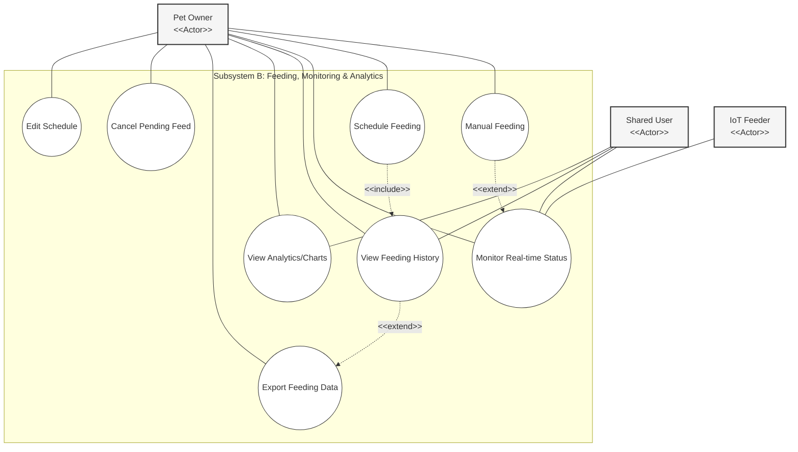
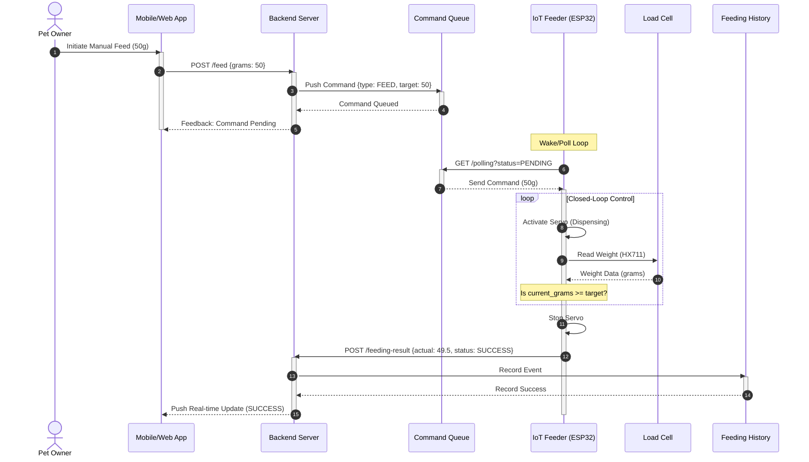
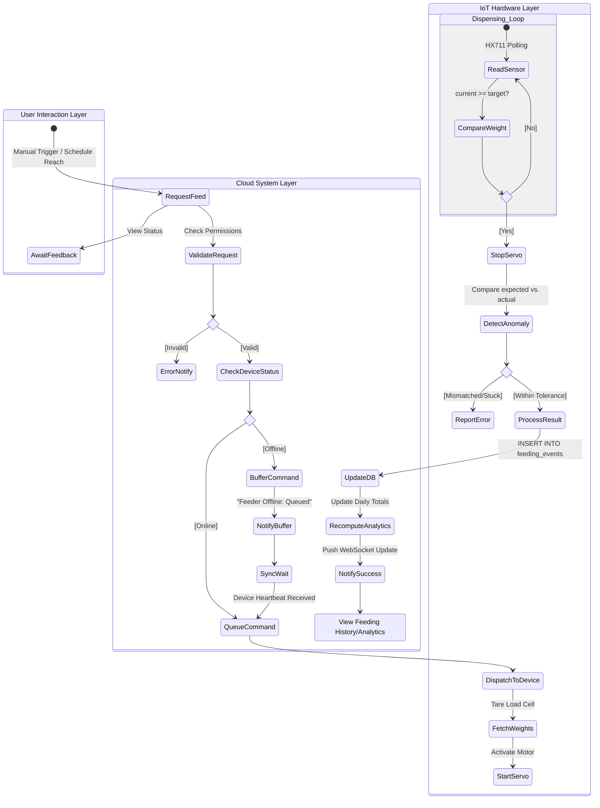

# Subsystem B: Feeding, Monitoring & Analytics

## 1. Diagrams Chosen
- Use Case Diagram – Feeding & Monitoring
- Sequence Diagram – Closed-Loop Feeding Operation
- Activity Diagram – Feeding Schedule & Execution Logic

## 2. Mermaid Diagrams

### 2.1 Use Case Diagram – Feeding & Monitoring

### 2.2 Sequence Diagram – Closed-Loop Feeding Operation

### 2.3 Activity Diagram – Feeding Execution & Monitoring Workflow

## 3. Documentation Draft Sections

### 5.1 Use Case Diagram – Feeding & Monitoring Subsystem
**Purpose:**
This diagram identifies the functional requirements associated with the core operation of the pet feeder: the dispensing of food and the subsequent analysis of consumption data.

**Subsystem Representation:**
It represents the internal logic of the "Feeding, Monitoring & Analytics" subsystem, bridging user intent with hardware execution and data visualization.

**Explanation of Key Elements:**
- **IoT Feeder Actor:** Now explicitly stereotyped to denote its role as an external system component providing feedback.
- **Analytics Extension:** Visualizes how optional data export functionality builds upon basic history viewing.

**System Design Decisions:**
The design ensures that all feeding triggers (manual or scheduled) are captured and logged centrally, allowing for unified analytics across all user touchpoints.

---

### 5.2 Sequence Diagram – Closed-Loop Feeding Operation
**Purpose:**
To detail the precise interaction between the cloud backend and the physical hardware during a dispensing event, emphasizing the importance of the load cell feedback.

**Subsystem Representation:**
Represents the critical "Closed-Loop Control" feature required for the project.

**Explanation of Key Elements:**
- **autonumber & Activation Bars:** Tracks the temporal flow and resource engagement across the cloud-to-hardware bridge.
- **Closed-Loop Loop Block:** Formally models the iterative sensor check that ensures dispensing accuracy.

**System Design Decisions:**
Utilizing a polling mechanism for the ESP32 ensures the system can bypass restricted network environments (NAT/Firewalls) while maintaining the integrity of command delivery.

---

### 5.3 Activity Diagram – Feeding Schedule & Execution Subsystem
**Purpose:**
To map the logical flow of a scheduled event using swimlanes to separate hardware, queue, and scheduling logic.

**Subsystem Representation:**
Represents the "Scheduling & Reliability" logic of the system.

**Explanation of Key Elements:**
- **Swimlanes (System, Queue, IoT):** Clearly delineates the boundary between cloud processing and edge execution.
- **Decision Node:** Handles the critical contingency of device offline status.

**System Design Decisions:**
The asynchronous queuing strategy allows for "fire and forget" scheduling from the user's perspective, with the system guaranteeing eventual execution upon device heartbeat.
