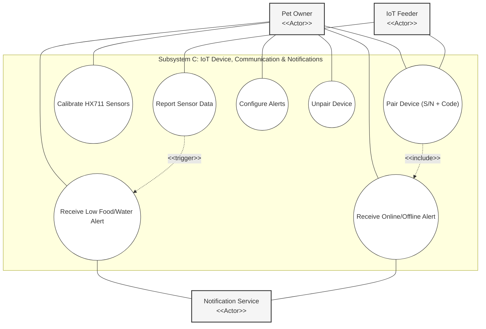
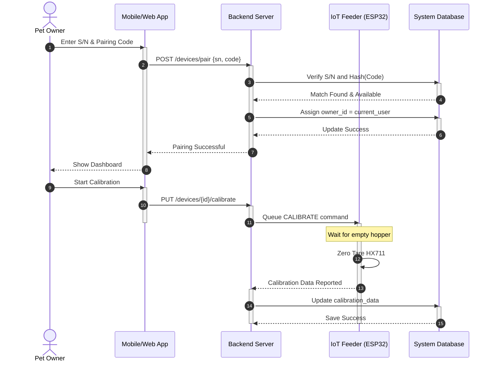
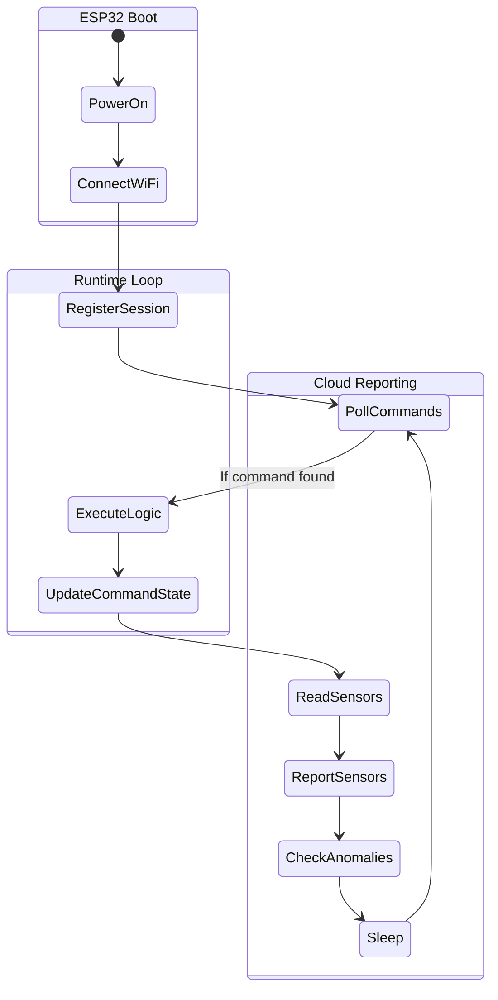

# Subsystem C: IoT Device, Communication & Notifications

## 1. Diagrams Chosen
- Use Case Diagram – Device Pairings & Alerts
- Sequence Diagram – Device Onboarding & Calibration
- Activity Diagram – IoT Device Firmware Runtime

## 2. Mermaid Diagrams

### 2.1 Use Case Diagram – Device Pairings & Alerts

### 2.2 Sequence Diagram – Device Onboarding & Calibration

### 2.3 Activity Diagram – IoT Device Firmware Runtime

## 3. Documentation Draft Sections

### 6.1 Use Case Diagram – Device Pairing & Notification Subsystem
**Purpose:**
This diagram maps the initial setup of hardware and the subsequent automated alerting mechanisms that keep the user informed.

**Subsystem Representation:**
Represents the "IoT Device, Communication & Notifications" subsystem, encompassing hardware interaction and external notification triggers.

**Explanation of Key Elements:**
- **Notification Service Actor:** A stereotyped external service that bridges system events to the user.
- **Sensor-Triggered Alerts:** Illustrates the automated flow where sensor data reports lead directly to user notifications.

**System Design Decisions:**
The choice to require a physical "Pairing Code" alongside a Serial Number provides a primitive but effective form of multi-factor authentication for hardware deployment.

---

### 6.2 Sequence Diagram – Device Onboarding Subsystem
**Purpose:**
To detail the handshake process between the frontend, backend, and hardware during initial deployment, utilizing activation bars to denote processing scope.

**Subsystem Representation:**
Details the "Connectivity & Setup" module.

**Explanation of Key Elements:**
- **Code Hashing:** Security measure where pairing codes are never stored in plain text.
- **Calibration Loop:** Shows how sensor accuracy is established at the hardware level but stored at the cloud level.

**System Design Decisions:**
Decoupling the pairing result from the calibration process allows the user to immediately access the dashboard while hardware-specific tuning happens as a background task.

---

### 6.3 Activity Diagram – IoT Device Runtime Subsystem
**Purpose:**
To model the continuous logic loop of the ESP32 firmware using swimlanes to separate boot logic, local processing, and cloud reporting.

**Subsystem Representation:**
Represents the Firmware and Communication protocol of the hardware.

**Explanation of Key Elements:**
- **Poll-Execute-Report Pattern:** The fundamental operating cycle for the device.
- **Anomaly Detection:** Internal firmware check that proactively reports issues before being polled.

**System Design Decisions:**
The decision to utilize a polling interval (10-30s) instead of active persistent connections reduces server overhead and allows the device to function effectively behind consumer firewalls.
