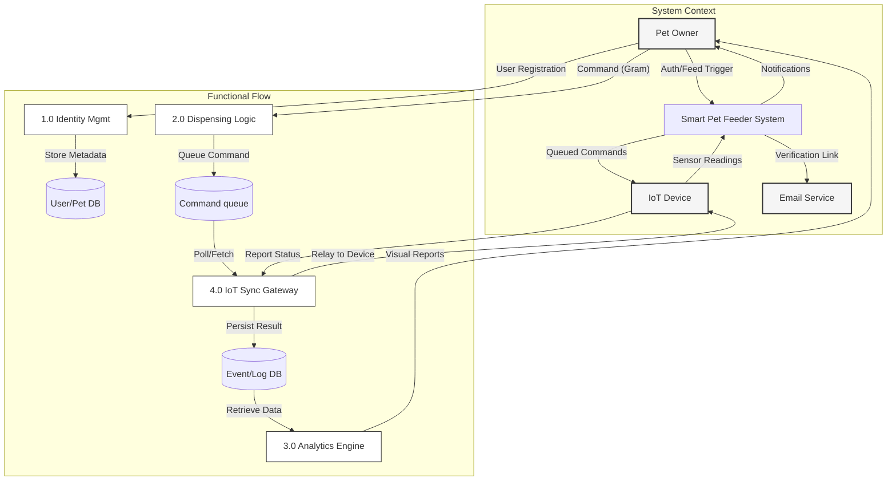
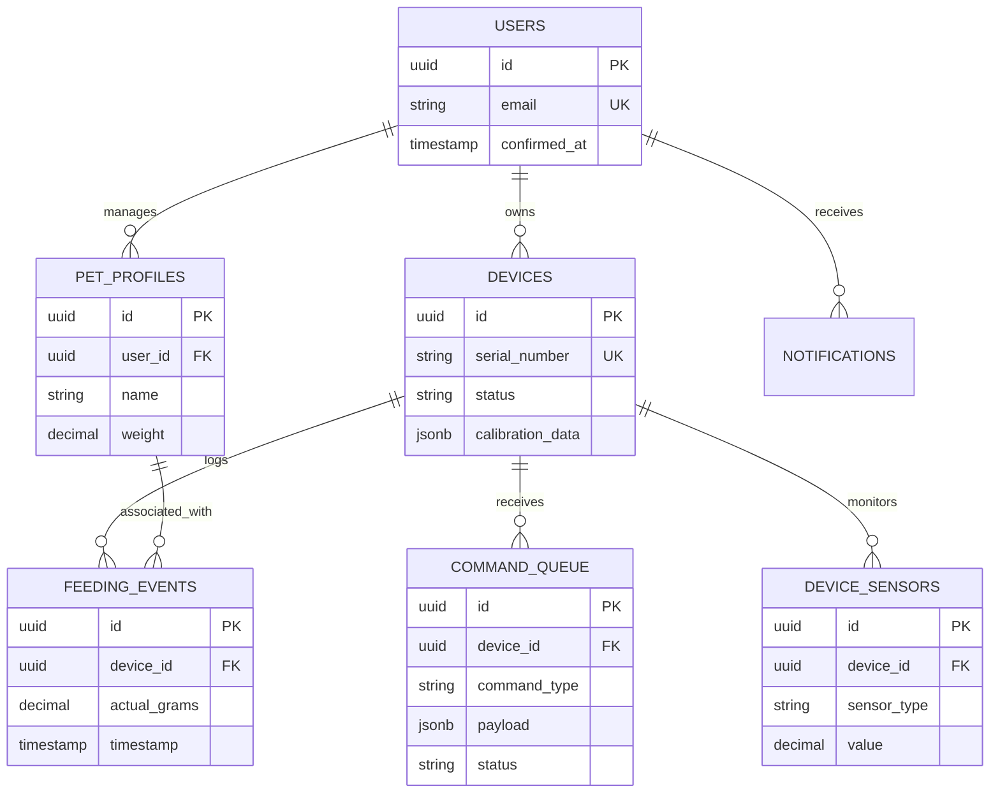
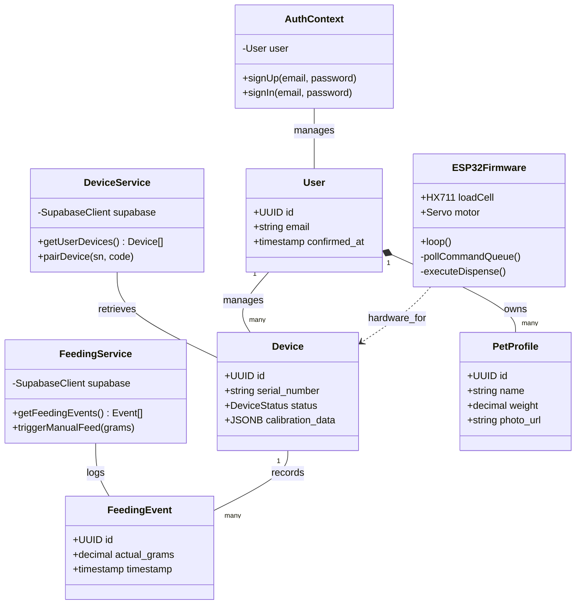
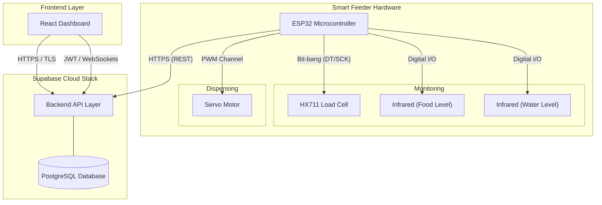

# Unified System Diagrams

## 1. Diagrams Chosen
- Data Flow Diagram (DFD) – Level 0 & 1
- Entity Relationship Diagram (ERD) – Unified Model
- Class Diagram – Principal Architecture
- Connectivity Diagram – Hardware/Cloud Overview

## 2. Mermaid Diagrams

### 2.1 Data Flow Diagram (DFD) – Level 0 & 1

### 2.2 Entity Relationship Diagram (ERD) – Unified Model

### 2.3 Class Diagram – System Component Architecture

### 2.4 Connectivity Diagram – Hardware-Rich Network Topology

## 3. Documentation Draft Sections

### 7.1 Data Flow Diagram (DFD)
**Purpose:**
To map the movement of information through the system, from user input to hardware execution and data persistence, without showing control flow.

**Subsystem Representation:**
Provides a cross-system view of data transitions across the management, execution, and analytics layers.

**Explanation of Key Elements:**
- **Level 1 (Functional Flow):** Explicitly separates the Identity management from the critical Dispensing logic and the IoT Sync Gateway.
- **Data Stores:** Identifies the central repositories for user metadata, command states, and operational logs.

**System Design Decisions:**
The architecture relies on a "Sync Gateway" process to handle the inherently unstable nature of IoT connectivity, ensuring that the core dispensing logic remains decoupled from the physical device's current online status.

---

### 7.2 Entity Relationship Diagram (ERD)
**Purpose:**
To model the database schema including primary/foreign keys and cardinalities, ensuring data integrity.

**Subsystem Representation:**
Represents the unified data model of the entire system.

**Explanation of Key Elements:**
- **Cardinalities:** Correctly maps that one user can own multiple devices but each device is owned by one user (1:N).
- **Entities:** Includes sensor logs and command queues as first-class citizens in the data model.

**System Design Decisions:**
Normalizing sensor data and feeding events into separate tables allows for high-frequency logs (sensors) to be purged or archived without affecting the historical feeding records.

---

### 7.3 Connectivity Diagram
**Purpose:**
To visualize the network and communication protocols used across the entire hardware-to-cloud ecosystem.

**Subsystem Representation:**
An architectural overview of the system connectivity.

**Explanation of Key Elements:**
- **Protocols (HTTPS, I2C, PWM):** Explicitly labels the communication standards used at each boundary.
- **Cloud Stack:** Details the internal components of the Supabase backend.

**System Design Decisions:**
The use of HTTPS/REST for the ESP32 is a deliberate choice to simplify firmware development and ensure compatibility with standard web proxies and firewalls.
